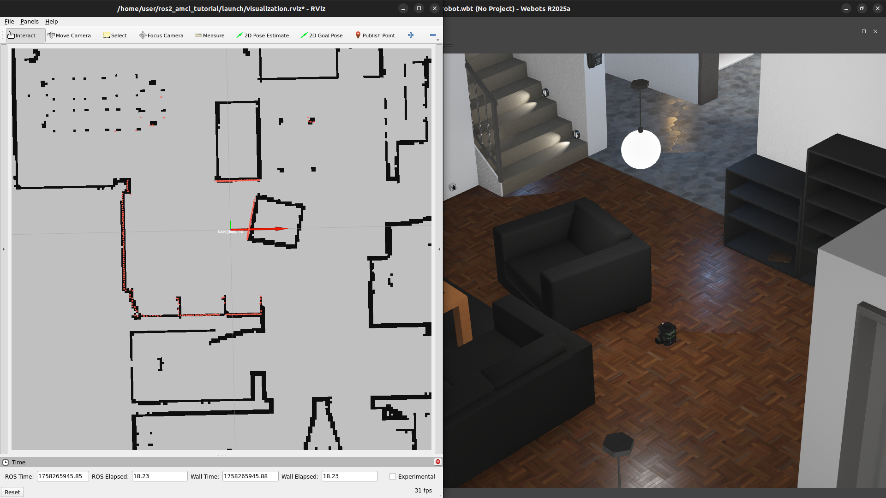

# AMCL Tutorial using ROS 2 and Webots

This tutorial demonstrates how the **Adaptive Monte Carlo Localization (AMCL)** algorithm works.
We will use the open-source implementation of the algorithm, [`nav2_amcl`](https://github.com/ros-navigation/navigation2/tree/main/nav2_amcl), from the [Nav2 ROS stack](https://docs.nav2.org/index.html).

The tutorial environment is based on **ROS 2** and the **Webots Simulator**.
If you are new to these tools, check the following resources first:
- [ROS 2 Documentation](https://docs.ros.org/en/humble/index.html)
- [Webots Documentation](https://cyberbotics.com/doc/guide/index)

---

## Setup and Prerequisites

To simplify the setup process, this tutorial provides two options:

1. **Pre-configured Virtual Machine (VM)**
2. **Docker Container with docker compose**

If you prefer to install everything directly on your own system, follow the instructions in [manual setup](/docs/setup.md).

---

### Option 1: Using the Virtual Machine

A ready-to-use VM template is available for download:
👉 [Download VM template](https://example.com/error) <!-- TODO: Replace with actual working link -->

Once downloaded, you can import the template into your preferred hypervisor (e.g., [VirtualBox](https://www.virtualbox.org/)).

**VM credentials:**
- **Username:** `user`
- **Password:** `1234`

> ⚠️ **Important:** To ensure you have the latest tutorial files, run the following inside the VM:
```bash
cd ~/ros2_amcl_tutorial
git pull
```

---

### Option 2: Using the Docker Container

This tutorial provides a Docker-based setup that includes all dependencies.

#### Step 1: Install Docker

Make sure Docker is installed on your system. Follow the official guides for your platform:
- [Linux](https://docs.docker.com/engine/install/)
- [Windows](https://docs.docker.com/desktop/setup/install/windows-install/)
- [macOS](https://docs.docker.com/desktop/setup/install/mac-install/)

#### Step 2: Build the container

The provided [`Dockerfile`](docker/Dockerfile) is located in the `/docker` folder of this repository.

To build the docker image for the container run:
```bash
git clone https://github.com/JorgeDFR/ros2_amcl_tutorial.git
cd ros2_amcl_tutorial/docker
docker compose build
```

#### Step 3: Run with docker compose

Because this tutorial requires **graphical interfaces** (e.g., RViz and the Webots Simulator), a [docker-compose.yml](docker/docker-compose.yml) file is included for convenience.
It handles container setup and display forwarding automatically.

To start the docker container run:
```bash
docker compose up -d
```

Then, to start a interactive terminal inside the container run:
```bash
docker exec -it ros2_amcl_tutorial bash
```

> ⚠️ **Note on GPU Acceleration:**
> By default, the container started above does **not** use GPU acceleration. This ensures compatibility across most machines.
> If your system has an NVIDIA GPU and the necessary drivers installed, you can uncomment the `ros2_webots_nvidia` service in the `docker-compose.yml` file and comment out the default `ros2_webots` service. This will enable GPU acceleration, which can significantly improve Webots simulation performance.

---

## Running the Simulation

After completing the setup you can start the simulation by navigating to the `launch` files directory and launching the tutorial:

```bash
cd ros2_amcl_tutorial/launch
ros2 launch run.launch.py
```

If everything is set up correctly, two main windows should appear on your screen:



### Webots Simulator Window

The first window is the **Webots Simulator**, which displays the robot and the environment in 3D. This is where the actual simulation runs, showing the robot’s movement and interactions with the world.

**Basic Controls:**
- **Left click + drag:** Move the view around.
- **Right click + drag:** Rotate the camera view.
- **Scroll up/down:** Zoom in and out.

### RViz Window

The second window is **RViz**, the ROS visualization tool. RViz displays sensor data, robot pose, and other relevant information computed by the AMCL algorithm, such as particle distributions and estimated positions.

**Basic Controls:**
- **Left click + drag:** Rotate the camera view.
- **Scroll up/down:** Zoom in and out.
- **Scroll wheel + drag:** Move the view around.


### Controlling the Robot

You can manually control the robot using the keyboard teleoperation node:

```bash
ros2 run teleop_twist_keyboard teleop_twist_keyboard
```

This will publish velocity commands to the robot in the Webots simulation.  allowing you to move the robot in the Webots simulation and test the AMCL localization in real-time.

---

## Main Tutorial Files

The main files used in the tutorial can be located inside the folder `launch`.

### Launch file

The launch file [run.launch.py](launch/run.launch.py) starts all the essential nodes for the tutorial:

- **Webots Simulator**: Launches the simulation environment.
- **Map Server**: Publishes the map for localization.
- **AMCL Node**: Runs the localization algorithm.
- **RViz**: Visualizes the robot, particle cloud, and sensor data.

### Configuration of the AMCL algorithm

The parameters used in the AMCL algorithm can be found in the file [config.yaml](launch/config.yaml), including:

- **Frames and Topics**: Robot frames and sensor topics.
- **Sensor Models**: Laser model settings and noise parameters.
- **Motion Models**: Robot motion model and associated noise.
- **Particle Filter Settings**: Number of particles, resampling interval, and convergence criteria.

You can modify these parameters to observe their effect on localization performance.
To do so, change the content of the file and them run the simulation once again.

---

### Understanding AMCL in Practice

Before starting the challenges, it is important to review what AMCL does, what its parameters mean, and how its results are visualized in RViz.

### Conceptual Introduction

First of all, to get a conceptual understanding of the AMCL algorithm, start by reading the [introduction to AMCL](docs/intro_amcl.md).
This will give you the necessary background on the **Adaptive Monte Carlo Localization** algorithm, its use of particle filters, and how it estimates the robot’s pose on a known map.

### Parameters

The parameters that control AMCL are defined in [config.yaml](launch/config.yaml).
For detailed explanations of each parameter, see the [AMCL parameter documentation](https://docs.nav2.org/configuration/packages/configuring-amcl.html#parameters).

### What You See in RViz

RViz shows the main components of the localization process:

- **Map** (gray/black grid): The static environment where the robot is localizing.
  - **Black pixels** represent occupied cells.
  - **Gray pixels** represent free cells.
- **Laser Scan** (red dots): The live sensor readings from the robot.
- **AMCL Particles** (small arrows): Each arrow represents a hypothesis of the robot’s pose. The distribution of arrows illustrates uncertainty.
- **Estimated Pose with Covariance**:
  - A **purple ellipse** represents the uncertainty in the robot’s *x,y* position.
  - A **yellow cone** represents the uncertainty in orientation.

The ellipse and cone of the estimated pose made by AMCL are a visualization of the probability distribution of the robot’s pose:
- A **smaller ellipse/cone** means AMCL is more confident about the position/orientation.
- A **larger ellipse/cone** means there is more uncertainty.

---

## Challenges

Now that you know how to run the simulation and interpret the results in RViz, it’s time to experiment.
Each challenge below is independent — you can try them in any order.

### 1. Initialize AMCL with a Different Pose

- In RViz, use the `2D Pose Estimate` tool (button on the top bar).
- Click on the map to place an arrow representing the robot’s estimated pose.
- Observe how the particle cloud initially disperses.
- Then, move the robot around the map and watch how the particles converge toward the robot’s real pose.
- Repeat this in:
  - A **symmetric area** of the map (e.g., long corridors or similar-looking rooms).
  - A **non-symmetric area** of the map (e.g., with unique features).


---

### 2. Experiment with Motion Models

- In [config.yaml](launch/config.yaml), change the motion model from
  `nav2_amcl::DifferentialMotionModel` to `nav2_amcl::OmniMotionModel`.
- Restart the simulation and observe how the particle cloud evolves.

Even though the robot is differential-drive, the particle filter will now simulate holonomic particle dispersion, meaning particles can move in all directions according to the motion model.

- Next, experiment with the **uncertainty parameters** `alpha1`–`alpha5`.
  - Increase the values to simulate a noisier robot motion.
  - Decrease the values to simulate more precise motion.

```yaml
robot_model_type: nav2_amcl::DifferentialMotionModel # nav2_amcl::DifferentialMotionModel | nav2_amcl::OmniMotionModel
alpha1: 0.2
alpha2: 0.2
alpha3: 0.2
alpha4: 0.2
alpha5: 0.2
```

---

### 3. TODO

TODO
